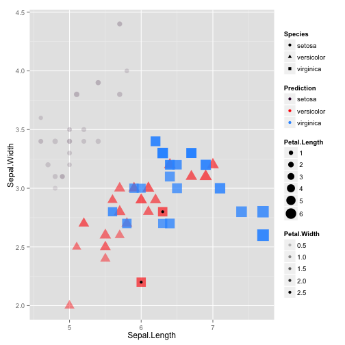

Iris Prediction Shiny App
========================================================


author: Zhongyi LIN  
date: July 26 2015

Overview
========================================================

This interactive Shiny application is based on the Iris data set and designed for fast and customized prediction. By specifying the following features:

- Two methods: random forest & decision trees (using radio button)
- Training set ratio: 0.6, 0.7, 0.75 or 0.8 (using radio button)
- Four predictors: sepal length, sepal width, petal length and petal width (using checkboxes)

one can perform quick prediction on iris species. When prediction is done, summary of the model, and confusion matrix, plots and comparison table of the results will be shown in tab panels.

Libraries needed: shiny, caret, ggplot2

Training Code Example
========================================================


```r
ratio <- 0.6

set.seed(3833)
index <- createDataPartition(iris$Species, p=ratio)[[1]]
training <- iris[index,]
testing <- iris[-index,]

set.seed(125)
modelFit <- train(training[,1:4], training[,5], method="rf")
Prediction <- predict(modelFit, testing)
Fault <- Prediction == testing$Species
result <- data.frame(testing, Prediction, Fault)
fault <- result[Fault==FALSE,]
```

Confusion Matrix Example
========================================================
Only part of the confusion matrix is shown here.


```r
confusionMatrix(Prediction, testing$Species)
```

```
            Reference
Prediction   setosa versicolor virginica
  setosa         20          0         0
  versicolor      0         20         2
  virginica       0          0        18
```

```
      Accuracy          Kappa  AccuracyLower  AccuracyUpper   AccuracyNull 
  9.666667e-01   9.500000e-01   8.847190e-01   9.959374e-01   3.333333e-01 
AccuracyPValue  McnemarPValue 
  1.698703e-25            NaN 
```

Plot Example
========================================================
Results are plotted using the ggplot2 plotting system. Variables are represented by different aesthetic features, i.e. size, color, shape. Error prediction are marked by black dots.


 
