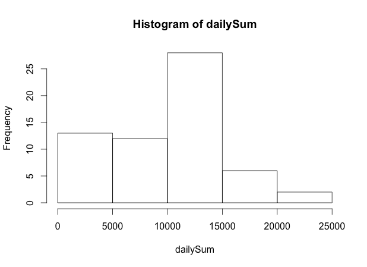
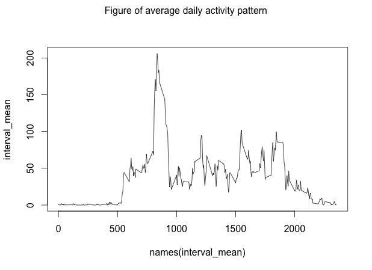
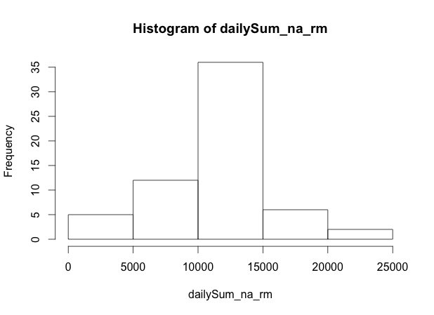
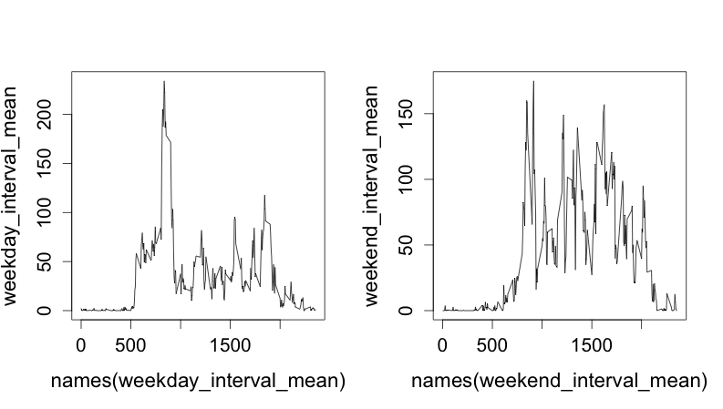

  
## Loading and preprocessing the data
  
```{r, echo=TRUE}
setwd("/Users/moderato/Desktop/r_wd")
activity <- read.csv("activity.csv")
```
  
## What is mean total number of steps taken per day?
  
```{r, echo=TRUE}
splitted_date <- split(activity, activity$date)
dailySum <- sapply(splitted_date, function(x){sum(x[,1], na.rm=TRUE)})
mean <- mean(dailySum, na.rm=TRUE)
median <- median(dailySum, na.rm=TRUE)
mean
median
hist(dailySum)
```


  
The mean and median total number of steps taken per day are as shown above.
  
## What is the average daily activity pattern?
  
```{r, echo=TRUE}
splitted_interval <- split(activity, activity$interval)
interval_mean <- sapply(splitted_interval, function(x){mean(x[,1], na.rm=TRUE)})
which(interval_mean == max(interval_mean, na.rm = TRUE))
plot(names(interval_mean),interval_mean, type="l")
mtext("Figure of average daily activity pattern", side = 1, line = -23, outer = TRUE)
```
  

  
The 104th 5-minute interval, namely 0835, on average across all the days in the dataset, contains the maximum number of steps.
  
## Imputing missing values
  
```{r, echo=TRUE}
naNumber <- length(which(is.na(activity[,1])))
activity_na_rm <- activity
activity_na_rm[which(is.na(activity[,1])),1] <- interval_mean[as.character(activity[which(is.na(activity[,1])),3])] ## Imput the NA value using the mean value of the corresponding interval
splitted_date_na_rm <- split(activity_na_rm, activity_na_rm$date)
dailySum_na_rm <- sapply(splitted_date_na_rm, function(x){sum(x[,1], na.rm=TRUE)})
mean_na_rm <- mean(dailySum_na_rm, na.rm=TRUE)
median_na_rm <- median(dailySum_na_rm, na.rm=TRUE)
mean_na_rm
median_na_rm
hist(dailySum_na_rm)
```
  

  
Here the NAs are imput by the the mean values of the corresponding intervals. We can see that both the mean value increases after imputting. This is because we use the dailySum variable to calculate mean and median, in which days with all data being NAs has a daily sum of 0. Thus the mean value is pulled down. If we change the 0s in dailySum back to NAs then calculate mean value, the result will be the same as that in the imputting scheme above. This process is shown below:
  
```{r, echo=TRUE}
temp <- dailySum
temp[as.numeric(as.character(which(dailySum==0)))] <- NA
mean(temp, na.rm=TRUE)
```
  
## Are there differences in activity patterns between weekdays and weekends?
  
```{r, echo=TRUE}
Sys.setlocale("LC_TIME", "en_US")
date <- as.Date(activity[,2])
weekday <- as.factor(weekdays(date, abbreviate = TRUE))
levels(weekday) <- list(weekday = c("Mon", "Tue", "Wed", "Thu", "Fri"), weekend = c("Sat","Sun"))
weekday_activity <- activity[which(weekday == "weekday"),]
weekend_activity <- activity[which(weekday == "weekend"),]
weekday_interval <- split(weekday_activity, weekday_activity$interval)
weekday_interval_mean <- sapply(weekday_interval, function(x){mean(x[,1], na.rm=TRUE)})
weekend_interval <- split(weekend_activity, weekend_activity$interval)
weekend_interval_mean <- sapply(weekend_interval, function(x){mean(x[,1], na.rm=TRUE)})
par(mfrow=c(1,2))
plot(names(weekday_interval_mean), weekday_interval_mean, type = 'l')
plot(names(weekend_interval_mean), weekend_interval_mean, type = 'l')
mtext("Figure of weekday and weekend activity pattern", side = 1, line = -23, outer = TRUE)
```
  

  
From the figures it can be obviously observed that there is a clear difference between weekends and weekdays activity patterns. In weekends the study subject is much more active during the day.
  